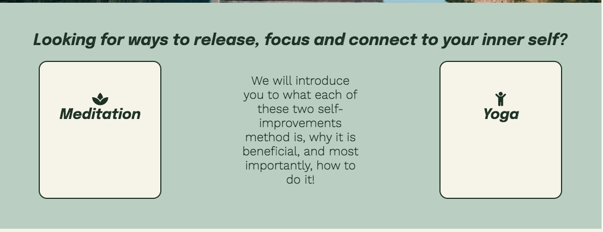
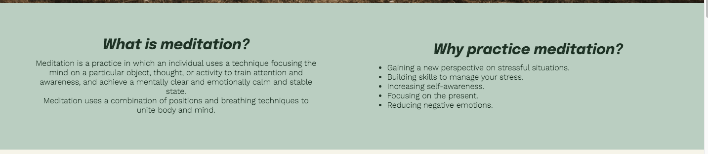
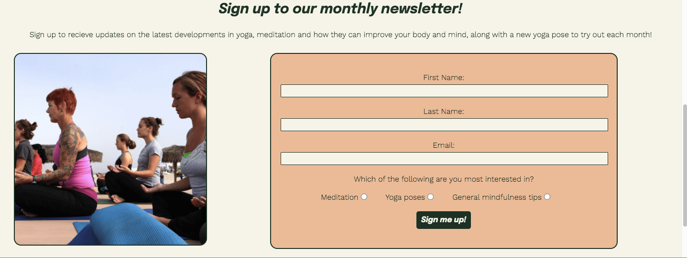

# Release

##  About

Release is a website that hopes to introduce users to two powerful self-improvement techniques; meditation and yoga.

The target users for this site will be novices searching for inspiration and reliable information about how they can improve themselves (both body and mind). These users will likely be unfamiliar with meditation and/or yoga so the site will cover all the basics for them. Release will act as a guide to what the benefits of meditation and yoga are, how they can perform these practices at home and prepare them for what equipment they might need. 

Release will also provide a great starting point for those that wish to go on and adopt meditation and/or yoga by providing them with useful links and materials that can be accessed by users in their own local areas. Users will also have the option of contacting a member of the Release team, or recieving monthly self-improvement and mindfulness tips through the monthly newsletter.

## Planning

Before beginning to write my code for this project, I spent a lot of time planning everything from the visual fonts, colours and layout, to the sort of features I would need to include to make my site successful and give a positive user experience.

### Fonts
For this site, I wanted to make sure I used easy to read fonts that also had a softness to them to reflect the tranquil feel of the site. I ended up selecting 'Epilogue' for my headings and 'Work Sans' for the body after finding them on awwwards.' [20 Best Google Fonts](https://www.awwwards.com/20-best-web-fonts-from-google-web-fonts-and-font-face.html) list.

### Colourscheme 
I chose a colourscheme from the [Shutterstock website](https://www.shutterstock.com/blog/color-palettes-for-websites?kw=&c3apidt=71700000083936683&gclsrc=aw.ds&gclid=EAIaIQobChMIp-mb39H19QIVCL_tCh1txAjJEAAYAyAAEgIlwfD_BwE). The colours chosen combine natural calming tones with an energetic orange to promote a mindful headspace.
I used my chosen four colours across the site to provide consistency for the user, and checked them against the [WebAIM contrast checker](https://webaim.org/resources/contrastchecker/) and also the [Eight Shapes contrast grid](https://contrast-grid.eightshapes.com/?version=1.1.0&background-colors=&foreground-colors=%231d3124%0D%0A%23e59560%0D%0A%23bacec1%0D%0A%23f6f4e8%0D%0A&es-color-form__tile-size=compact&es-color-form__show-contrast=aaa&es-color-form__show-contrast=aa&es-color-form__show-contrast=aa18&es-color-form__show-contrast=dnp) as seen in the screenshots below (the one for the singular colour contrast was to check the accessibility of the active class on the navigation bar, a variation on the usual orange used.)

### Target audiences
- Users searching to connect their bodies and minds
- Users looking to promote self-improvement who have not heard of the specific methods of meditation and yoga
- Users who have heard about meditation and/or yoga and wish to know more about how it can help them and how they can do it
- Users who have some familiarity with the practices and are looking to connect with more resources, such as equipment or how to find a group to join
- Although a large bulk of visitors will be first-time visitors using Release as a base, returning visitors can benefit from the demonstration resources or equipment links to strengthen their existing practice

### User Stories
As a user, I am looking to improve myself and my mental wellbeing. I am looking for a reliable site that can teach me how I can do this.

I need to come away from the site with a clear understanding of one or more different methods I can do in order to connect to my body and mind and become a better me. I will need to know what things I can do, and what benefits I can expect when using them. As a beginner I will also need materials to help me learn how to do them, such as instructions and demonstrations. I also need to know what, if any, equipment I may use to carry them out.

I may also require additional support. I would like the opportunity to reach out if there is something I do not quite understand or if all my questions haven't been answered, or if there are any communities I can join to help me with this journey. I would also like the option to sign-up to recieve further information, and specify this request to the area that I am most interested in.

To be able to do all this I will need a site that is clear in its purpose and can be easily navigated. I want to be able to find specific topics easily and be able to navigate them at all times without causing frustration. I will deem my visit to the site successful if I can come away from it feeling like I have gained valuable information and a solid starting point on my journey to self-improvement.

### Release's Aims
- To help the user understand their are two great methods of self-improvement- meditation and yoga
- To encourage the users to explore these different practices
- To educate the user as to what these methods are, how they can benefit them and how to do them
- To provide further resources by giving links to equipment and sites where they can find groups to join
- To provide a contact information so that the user can reach out if they wish to do so
- To encourage the user to sign up to receive a monthly newsletter from Release, and be able to give their preference as what they would like to hear about

When planning Release's website, I had to consider how I was going to achieve both the above aims for the user, and for the organisation. This led to the creation of all the features found in the Features section.

## Features

- ### Nav bar 
    - the navigation bar is a consistent feature across all pages of the site. It includes links to the Home Page, Meditation page, Yoga page and the Signup page. It is located at the top of each page and is 'sticky' so that the user can intuitively locate and use to easily navigate between pages across all devices no matter how far down their current page they are. The hover effect used allows the user to clearly define the links that they can click on with a transition effect (credited in Credits section). Additionally, the active class means that visitors to the site can easily work out which page they are currently on.
    - The navigation bar appears horizonal for larger screen sizes, however for smaller screen sizes it appears vertically to keep its design elements.
    - The navigation bar features the the large Release text at either the centre (for large screen sizes) or at the top (smaller screen sizes). This text was given key position and designed to stand out as it forms the logo for Release.
    - The links for meditation, yoga and contact all include relative icons to make their functions more easily recognised by users.
    
    

- ### Hero Images
    - The large hero images serve to grab the user's attention and to set the tone of the site. They demonstrates the type of tranquility and peacefulness that can be found when practicing meditation and yoga and inspires the user to attain the same. The hero image on the Release homepage also contains a zoom animation for effect.
    

- ### Footer 
    - The footer is also a feature on all pages, allowing the user to access Release's Facebook, Twitter and Instagram social media platforms. It also contains an email address for Release, providing an alternate route for users to access contact information without having to navigate to a different page, along with providing copyright information.
    

- ### Home page
    - Ways to connect section - this section serves to pique the user's curiosity, introduce the user to the two self-improvement techniques focused on in the site and highlight what information they can expect to find in the relevant pages.
    
    - Newsletter and graph section - this section compliments the rest of the homepage by including a data graph to reassure users that the site is a reliable source of information and there are real proven benefits to the self-improvement menthods included. The image demonstrates the state of mindfulness the user may be hoping to achieve. This section also promotes Release's monthly newsletter and what they can expect from it.
    

- ### Meditation and Yoga pages
    - Intro section - gives the user an understanding of what each method entails and how it can be beneficial to them. This is presented first on the page as they are more likely to carry on reading once they have seen the positive effects both meditation and yoga give.
    
    - How to section - gives the user a basic understanding of how to undertake the practice and provides resources for further information. The image gives a visual demonstration and the video provides a more immersive experience for the user (does not autoplay as per best practice)
    
    - Equipment section - allows the user to see what equipment they might need. Links to buy equipment which may make the user excited to have a go at one or both of the practices. Also provides 'at home' alternatives for those who want to try meditation or yoga out before investing. Also has a call to action button to entice the user to find a meditation/yoga group near them, as many people like the social aspect of exercise or are more committed when part of a group.
    

- ### Contact and Sign-up page
    - Contains varied contact information for Release for users seeking more help or information.
    - The sign-up form not only allows the user to sign up to the monthly newsletter but lets them set preferences for what kind of information they would like to recieve (meditation, yoga or general mindfulness tips), in turn giving feedback to Release to see what area is the most popular. The user will also be asked to submit their full name and email address.
    - The form inputs are all 'required' to make sure all data is input by the user and of the correct type
    

- ### Future features
    - Would like to add inspirational quotes layered over existing layout to inspire users
    - Would like to add carousel made up of yoga poses to give users more inspiration, and encourage users to return to the site
    - Would like to add a 30-Day Meditation and (or) Yoga tracker/ challenge to enagage users and help them track their progress, as it can take some time for habits to form. People who have committed to something for 30 days are more likely to continue it

## Wireframes

Before building my site in Gitpod, I took all of the features I thought to be in scope and combined these with my design ideas to create wireframes in Balsamiq.

For the most part I was able to stay true to these wireframe plans, however there was a couple of deviations. In signup.html for smaller screen sizes, instead of moving the  image to the bottom of the page as per the wireframe, I decided in testing to omit the signup-class image. I felt that this gave better focus to the form itself.

- [Index.html wireframe](wireframes/index.html-wireframe-tiny.jpg)
- [Meditation.html wireframe](wireframes/meditation.html-wireframe-tiny.jpg)
- [Yoga.html wireframe](wireframes/yoga-wireframe-tiny.jpeg)
- [Signup.html wireframe](wireframes/signup.html-wireframe-tiny.jpg)

## Deployment

The site was deployed and hosted using GitHub's Pages feature. The steps to deploy are as follows:
- In the GitHub repository, navigate to the Settings tab
- Find and select Pages from the menu on the left
- From the source section drop-down menu, select the Main Branch
- Once the Main branch has been selected, click save.
- The page should refresh automatically with a ribbon display to indicate the successful deployment. However, it may take a moment for the site to deploy.

The live link can be found here - ********************

## Credits

- ### Content
    - Colourscheme-  [Shutterstock](https://www.shutterstock.com/blog/color-palettes-for-websites?kw=&c3apidt=71700000083936683&gclsrc=aw.ds&gclid=EAIaIQobChMIp-mb39H19QIVCL_tCh1txAjJEAAYAyAAEgIlwfD_BwE)
    - Definitions- formed using Wikipedia.com for [yoga](https://en.wikipedia.org/wiki/Yoga) and [meditation](https://en.wikipedia.org/wiki/Meditation)
    - Benefits of meditation found from the [Mayoclinic website](https://www.mayoclinic.org/tests-procedures/meditation/in-depth/meditation/art-20045858)
    - How to meditate steps taken from [Mindful](https://www.mindful.org/how-to-meditate/)
    - Benefits of yoga researched from [Hopkins Medicine](https://www.hopkinsmedicine.org/health/wellness-and-prevention/9-benefits-of-yoga)
    - Some inspiration taken form The Code Institute 'Love Running' project, so there may be some code similarites. In particular, I used this as a base for my hero image sections/animation and the sign-up form
    - I found this [Youtube tutorial](https://www.youtube.com/watch?v=H-AmJSMcNfI&ab_channel=Divinector) to help create horizontal version of my navigation bar used for smaller screen sizes, and gave me the inspiration for to use the transition effect on nav:hover on the header
    - I looked at popular mindfulness site such as [Calm](https://www.calm.com/) for inspiration for the design of my site before adding my own spin

- ### General reference
    - [W3Schools](https://www.w3schools.com/html/)
    - [CSS Tricks](https://css-tricks.com/snippets/css/a-guide-to-flexbox/)
    - [Stack Overflow](https://stackoverflow.com/)
    - Not used for code but definitely worth a mention for my README.md file. I found the example from a lead student, David Bowers, who had posted a link to [his repository](https://github.com/dnlbowers/modern-buddhism/blob/main/README.md#site-overview) on Slack extremely useful. I used this along the Code Institute [example README.md](https://github.com/Code-Institute-Solutions/readme-template)

- ### Media
    - Correlation-graph made by me using [Canva](https://www.canva.com/en_gb/)
    - Images found on [Unsplash](https://unsplash.com/) and [Pixabay](https://pixabay.com/)
    - How to meditate video from [Goodful](https://www.youtube.com/channel/UCEMArgthHuEtX-04qL_8puQ) on Youtube
    - Introduction to yoga video from [Yoga with Adrienne](https://www.youtube.com/watch?v=v7AYKMP6rOE&ab_channel=YogaWithAdriene) on Youtube
    - Fonts from [Google Fonts](https://fonts.google.com/)
    - Icons used from [FontAwesome](https://fontawesome.com/v5/search)
