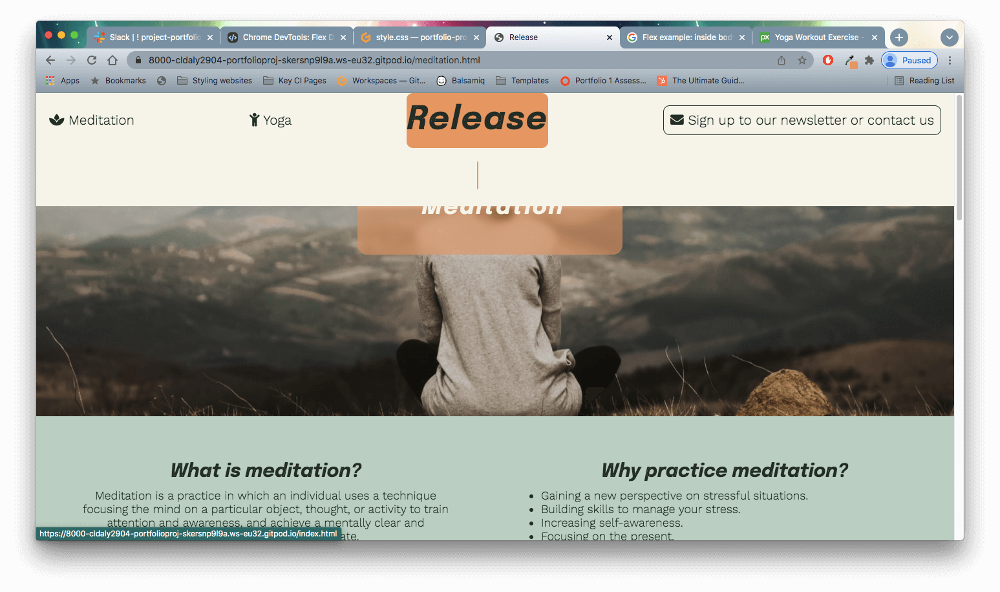

## Testing

Whilst testing my site, I mainly used a combination of a live server extension (port 800 on Gitpod), and Chrome DevTools.
I used DevTools to create a responsive site that maintains solid design structure down to a width of 320px, with the last media query necessary at 354px.

To test responsiveness, I also opened the site on the different screen sizes of my iPhone and iPad. This gave me the opportunity to see if the proportions felt natural on these screen sizes and also to test the compatability with Safari, as most of the development was with Chrome. 

I found writing the CSS for all of my media queries fairly challenging, and considered that less alterations might have been needed if I had designed with a mobile-first site in mind. This was definitely a future learning point (but of course I will still need to take into consideration the target users and site purpose as to how it will most widely be used).

I sent the link to the site for potential users to test on their devices, including Android and different screen sizes and no issues were flagged up.

## Fixed Bugs

Whilst testing the live site at different stages of building the site, I encountered some unexpected results and bugs. To solve these I largely experimented with changing code and spent a lot of time researching on sites such as [W3Schools](https://www.w3schools.com/html/), [CSS Tricks](https://css-tricks.com/snippets/css/a-guide-to-flexbox/) and [Stack Overflow](https://stackoverflow.com/).

- ### Header content overflowing
    - At one point the header content was overflowing from the header element horizontally, resulting in some of it getting cut off. I used git to compare to earlier versions of code where this had not been happening and I found the extra style in style.css for the header- the insertion of width: 100%;

- ### Overlapping header 
    - After applying media queries to change the layout of the header at 950px and down, the header then overlapped and covered some of the body content beneath it. I tried altering the positioning of the header to see if any of those styles were causing the bug, but after a little research realised I needed to add a margin to the top of the hero image to 'push' that content further down the page to sit under the header

- ### Hover pseudo class on nav bar
    - Another interesting bug I encountered with the header was when applying the hover effect of an orange background for the nav links. When clicking back onto the Release home page, part of the orange highlight had overflowed onto a new line. I tried lowering the amount of padding, changing the line height and commented out code to confirm it was the :hover pseudo class causing it. In the end I solved it by changing the h1 element in the header and using a ul and li elements nested inside the nav

- ### Content overflowing div on different screen sizes
    - Whilst testing the Release site on different screen sizes, I noticed that on smaller screen sizes around 800px wide and lower, the content of the sections/divs began to overflow. I used Google Chrome's dev tools to analyze the styles applied and found that it due to the fact that I had fixed the height of the divs. I came across the fix for this whilst experimenting with different values for the height attribute, where the shortcut for 'height: fit-content' appeared. Once I had applied this style to all the sections/divs, I added padding to keep the desired layout and now I have responsive sections that transform for all screen sizes

- ### Active class on header
    - One of my aims for a user friendly navigation was to have an 'active' class on the header to show the user which page they were currently on. However, I had recurring issues with this working on the sign-up and contact page. This problem came both in design issues (the original plan of an underlined active class didn't show over the border for the sign-up page link), and code errors. After reforming my design to a having the active page be signalled by a slightly different colour background, testing showed that this had not been successfully applied for the sign-up.html page. After a few different attempts (and a brainwave), I realised my error had been to do with CSS specificity and corrected the order of my styles accordingly.

## W3C HTML Validator

When I first ran my completed site through the W3C HTML validator, it flagged up a few issues on my meditation.html and yoga.html pages.
- Firstly, I had missed a couple of div closing tags. As I had reused the code from meditation.html for yoga.html, these had copied over, but I was able to identify where the closing tags were required and fix the issue.
- The validator also flagged up that I had incorrectly used br tags, which were not allowed to be nested inside my unordered lists for the "How to" and "What equipment might I need?" sections. For some I simply removed the HTML tags, but my desired outcome for the "How to" instructions was for the second half of the instructions to appear on a new line below the italic writing. After checking W3C Schools, I read that I could instead use hr inside my unordered list, so updated the necessary tags and kept my intended design. 

When I went back to take screenshots of my W3C schools, the site was having issues with its server so I then used Rocket Validator for evidence and a [report](https://rocketvalidator.com/s/d25e2f3c-4e0d-4a73-949e-58c58f91f5c8).

## Jigsaw CSS Validator
- No issues detected running through the official [Jigsaw Validator](https://jigsaw.w3.org/css-validator/)

## Lighthouse

Original lower score for perfomance from using large image files. I used [Tiny.png](https://tinypng.com/) to compress all image files and reduce them in size before re-importing them and checking all of the new filepaths were correct. This improved performance scores, but they were still not optimal and the hero image for index.html was causing a particular issue meaning the score for that page was below 90.

Lighthouse suggested the improvement of using more modern file formats than the jpegs I was using. I decided to use webp as my research suggested that it was more widely used than avif. However, as not all older browsers support webp images, I decided to only convert decorational images to this format and leave the graph and "how to" demonstration images in the jpeg format as they are essential for user experience. I also added a backup background colour for the hero images so that older browsers could still maintain some styling.

The only other issue thrown up by Lighthouse was to alter some of the text used for links to external pages for better semantic meaning. E.g. I changed shop zafu *here*, to *shop zafu here*.

On the whole the desktop scores scored slightly higher than the mobile scores, but all now pass above a score of 90.
Below are my final Lighthouse scores for index.html, meditation.html, yoga.html and signup.html using incognito mode in Chrome:

## WAVE

In addition to HTML, CSS and Lighthouse validators, I used the [WebAIM](https://wave.webaim.org/) web accessibility evaluation tool to test the accessibility of my website with no errors or contrast errors showing.

## Unfixed bugs

- As I was testing and solving issues throughout building Release, by the time of project completion there were no un-fixed bugs that I had found.